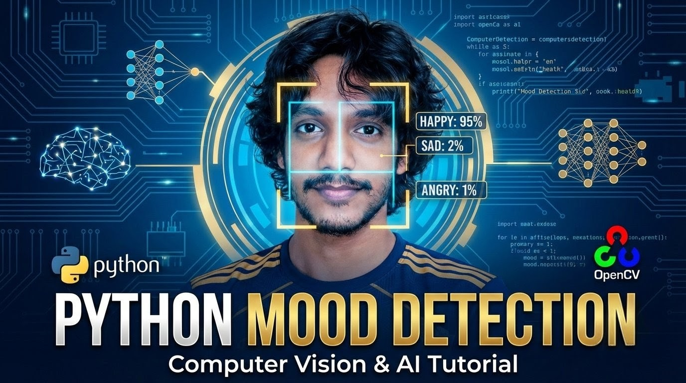

# Real-Time Emotion Detection

A simple and efficient Python script that detects faces and analyzes human emotions in real-time using a webcam (compatible with Iriun Webcam and default laptop cameras). It uses OpenCV for video capturing and DeepFace for highly accurate emotion prediction.

## 📸 Preview



## 🚀 Features
- **Real-Time Detection:** Captures video feed and processes frames on the fly.
- **Emotion Recognition:** Predicts emotions like Happy, Sad, Angry, Surprise, Neutral, etc.
- **Crash Prevention:** Bypasses errors seamlessly if no face is detected in the frame.
- **Iriun Webcam Support:** Easily configurable to use external mobile webcams via Iriun.

## 🛠️ Requirements

Before running the script, make sure you have Python installed on your system. You will need the following libraries:

- `opencv-python`
- `deepface`

You can easily install them using the provided `requirements.txt` file.
```bash
  pip install -r requirements.txt
  

## ⚙️ Installation

1. Clone this repository to your local machine:
   ```bash
   git clone https://github.com/Tarekuzjaman0/Emotion-Detection.git